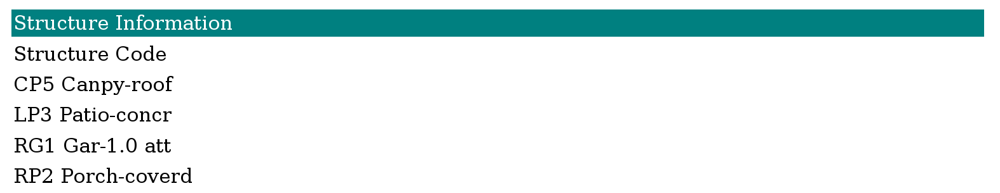

Using Scarsdale's property inquiry website
=============================================
Scarsdale just changed how it assesses the value of properties for
tax purposes, and they've put a lot of cool information up on the
internet in the
`property inquiry website <http://www.scarsdale.com/Home/Departments/InformationTechnology/PropertyInquiry.aspx>`_.
Here's how you use it.

Looking up particular a property
----------------------------------

Let's look up 54 Walworth Avenue, the house that I grew up in.
We look at the "Please choose a street name" section and scroll
until we find the street "WALWORTH". We click on "WALWORTH".

Then we get an unlabeled box with a bunch of street addresses.
We click on "54 WALWORTH".

This gives us back a `long webpage <54-walworth/full.png>`_
with lots of stuff on it.

Information about a property
------------------------------
Let's go through all the information that you get back on that
webpage. This webpage is grouped into different sections.

1. Property information
2. Assessment information

  * Assessed value
  * Taxable value
  * Special districts
  * Exceptions

3. Building information
4. Structure information
5. Tax information
6. Permits

Property information
~~~~~~~~~~~~~~~~~~~~~~~
This section tells us information about the land.

.. image:: 54-walworth/property-information.png

"Nbhd Cd" stands for "neighborhood code",
and "402" is the code number for the neighborhood.
Similarly, "210" is a code number for single-family
residences.
Otherwise, I think this section is pretty straightforward.

Assessment information
~~~~~~~~~~~~~~~~~~~~~~~
This section tells us what the assessment is for tax purposes.
It is broken into different sections for different taxes.

The "Assessed Value" section was the main one that confused me.
"Prelim. 2014 AV" is the preliminary 2014 assessed value,
"2013 FMV AV" is the 2013 full market value, and 
"2013 AV" is the 2013 assessed value. The first of these figures
is the new assessment, and the other figures are explained
`here <http://thomaslevine.com/!/scarsdale-tax-bill/>`_.

The "Excemptions" section is tax excemptions that are based on
the people who own or occupy the house. (I don't know exactly how
they're determined.)

Building information
~~~~~~~~~~~~~~~~~~~~~~~
This section tells us about the building that is on the property.

.. image:: 54-walworth/building-information.png

XXX Explain what the different sections mean.
XXX reference the assessor's manual.

Structure information
~~~~~~~~~~~~~~~~~~~~~~~
This section tells us a bit more about what's in the house.

XXX reference the assessor's manual.

Tax information
~~~~~~~~~~~~~~~~~~~~~~~

Permits
~~~~~~~~~~~~~~~~~~~~~~~

.. image:: 54-walworth/permits.png
